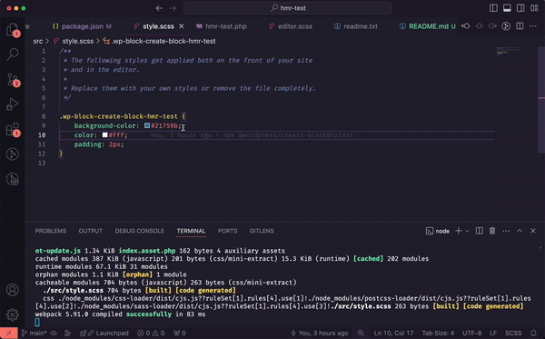

# wp-scripts hot-reloading tests and questions

## Installation

Clone this repo, ensure you are using Node 20, and run `npm install`.

Then, start the local WordPress test environment with `npm run env:start`.

## `--hot` does not reload CSS

Expected: Running `wp-scripts start --hot` would allow me to make changes to CSS and see those changes reflected live.

Actual: Running `npm run start` (an alias for the `wp-scripts start --hot` command) starts a DevServer instance that _says in the console_ that it is reloading, but changes to the block's `style.scss` file have no effect.



**Testing**

Set `HMR_TEST_VARIANT` to `css-reloading` in the [`hmr-test.php` file](./hmr-test.php), then run

```
HMR_TEST_VARIANT=css-reloading npm start
```

## Block registration details cannot change during HMR

Expected: Changing a block's attributes or category would take effect immediately when using Hot.

Actual: Editing React components works, but changing a block's attributes or category in `block.json` or `index.js` causes a full-page reload. Trying to work around this by adding `module.hot.accept()` to the index.js entrypoint causes hot-swapping to fail with the error,

> ```
> Block "create-block/hmr-test" is already registered.
> ```

**Testing**

Set `HMR_TEST_VARIANT` to `block-hot-swapping` in the [`hmr-test.php` file](./hmr-test.php), then run

```
HMR_TEST_VARIANT=block-hot-swapping npm start
```

Edit a block attribute to trigger the error, for example by changing the icon (we suggest `buddicons-activity`) to `blocks.json`, or adding an attribute definition like the following:

> ```
> 	"attributes": {
> 		"text": {
> 			"type": "string"
> 		}
> 	},
> ```

To enable the hot-swapping code fix, un-comment the commented lines within the block registration call (`...metadata`) and at the bottom of [`block-hot-swapping/src/index.js`](./block-hot-swapping/src/index.js)

## Multiple Blocks cannot all hot-reload at once

Expected: If you have multiple blocks, `--hot` "just works" for all of them.

Actual: Only one block bundle will hot-swap at a time, although a warning will be shown — the other block will not update. For example, editing the `Edit` component of `multiple-blocks/src/blocks/hmr-test-2` causes this error,

> ```
> [HMR] Update failed: Loading hot update chunk blocks/hmr-test/index failed.
> (missing: http://localhost:8888/wp-content/plugins/hmr-test/multiple-blocks/build/blocks/hmr-test/index.88f75532ddeaaa697f97.hot-update.js)
> ChunkLoadError
```

and edits to `multiple-blocks/src/blocks/hmr-test-2` have no effect.

**Testing**

Theoretically, a single runtime chunk in Webpack is meant to fix this. But if you create one, the blocks won't load by default.

Uncomment the lines in [`hmr-test.php`](./hmr-test.php) to
